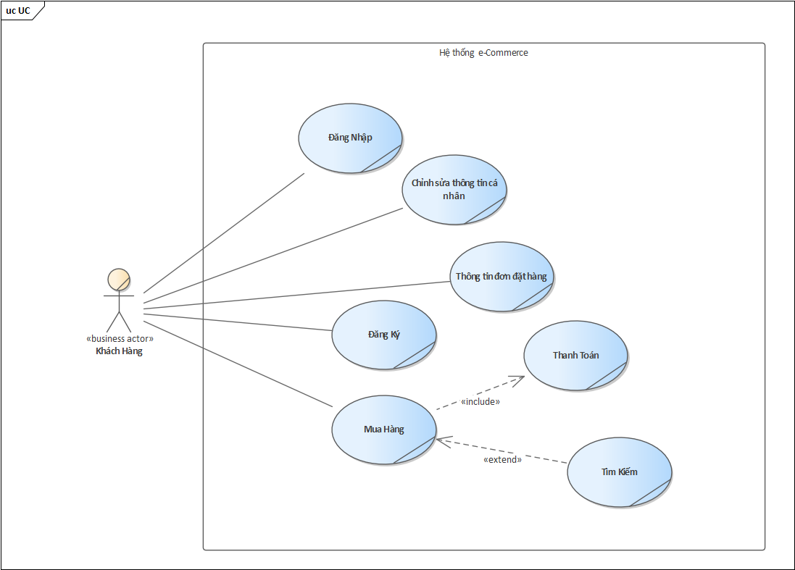
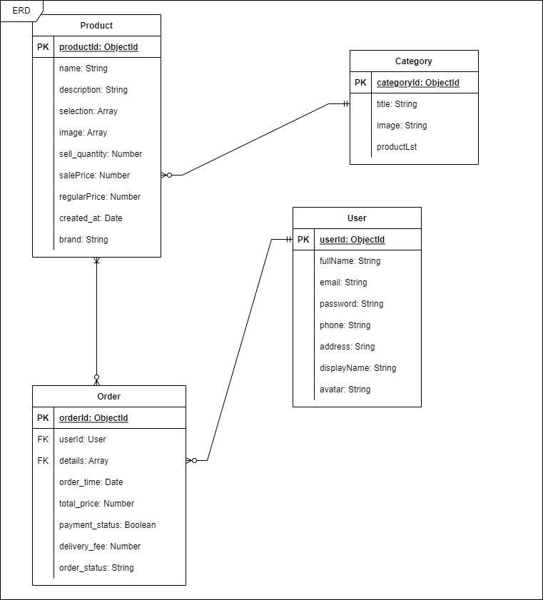
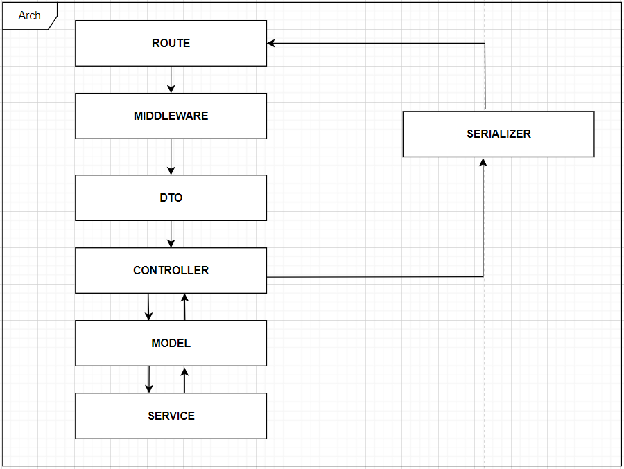

# Danh sách các APIs

## 1. Đăng ký

```
POST https://floating-depths-39999.herokuapp.com/api/auth/register
Content-Type: application/json

{
    "fullName": "string",
    "email": "string",
    "password": "string"
}
```

## 2. Đăng nhập

```
POST https://floating-depths-39999.herokuapp.com/api/auth/login
Content-Type: application/json

{
    "email": "string",
    "password": "string"
}
```

## 3. Lấy thông tin người dùng theo mã người dùng

```
GET https://floating-depths-39999.herokuapp.com/api/auth/getUserInfo?userId=${userId}

```

## 4. Lấy địa chỉ giao hàng theo mã người dùng

```
GET https://floating-depths-39999.herokuapp.com/api/auth/getDeliveryAddress?userId=${userId}

```

## 5. Cập nhật thông tin người dùng theo mã người dùng

```
POST https://floating-depths-39999.herokuapp.com/api/auth/updateUserInfo?userId=${user_Id}
Content-Type: application/json

{
    "fullName": "string",
    "displayName": "string",
    "oldPassword": "string" || "",
    "password": "string" || ""
}
```

## 6. Cập nhật địa chỉ giao hàng theo mã người dùng

```
POST https://floating-depths-39999.herokuapp.com/api/auth/updateDeliveryAddress?userId=${user_Id}
Content-Type: application/json

{
    "fullName": "string",
    "phone": "string",
    "city": "string",
    "district": "string",
    "ward": "string",
    "apartmentNumber": "string"
}
```

## 7. Lấy tất cả sản phẩm

```
GET https://floating-depths-39999.herokuapp.com/api/product/getAllProducts?_page=&_limit=&_sort=('bestSelling' || 'newProduct')
- _sort=bestSelling => Sắp xếp theo sản phẩm bán chạy
- _sort=newProduct => Sắp xếp theo sản phẩm mới về
=> Có thể lấy tất cả thông tin sản phẩm mà không cần _page, _limit, _sort thông qua API sau:
GET https://floating-depths-39999.herokuapp.com/api/product/getAllProducts
```

## 8. Lấy thông tin sản phẩm theo mã sản phẩm

```
GET https://floating-depths-39999.herokuapp.com/api/product/getProduct?productId=${product_id}
```

## 9. Lấy tất cả danh mục sản phẩm

```
GET https://floating-depths-39999.herokuapp.com/api/product/getAllCategories?_page=&_limit=
=> Có thể lấy tất cả danh mục mà không cần _page, _limit thông qua API sau:
GET https://floating-depths-39999.herokuapp.com/api/product/getAllCategories
```

## 10. Lấy tất cả sản phẩm theo mã danh mục

```
GET https://floating-depths-39999.herokuapp.com/api/product/getAllProductsByCateId?categoryId=${category_id}?_page=&_limit=

*category_id (Mã danh mục)
    - 61ce7ce47d10682b1816a67d: Thời Trang Nam
    - 61ce7ce77d10682b1816a67f: Điện Thoại & Phụ Kiện
    - 61ce7ce97d10682b1816a681: Thiết Bị Điện Tử
    - 61ce7cea7d10682b1816a683: Máy tính & Laptop
    - 61ce7cec7d10682b1816a685: Máy Ảnh & Máy Quay
    - 61ce7cef7d10682b1816a687: Đồng Hồ
    - 61ce7cf07d10682b1816a689: Giày Dép Nam
    - 61ce7cf27d10682b1816a68b: Thiết Bị Điện Gia Dụng
    - 61ce7cf47d10682b1816a68d: Thể Thao & Du Lịch
    - 61ce7cf67d10682b1816a68f: Ô Tô & Xe Náy & Xe Đạp
=> Có thể lấy tất cả sản phẩm theo mã danh mục mà không cần pagination thông qua API sau:
GET https://floating-depths-39999.herokuapp.com/api/product/getAllProductsByCateId?categoryId=${category_id}
```

## 11. Tạo đơn hàng lúc tiến hành thanh toán, sẽ trả về sessionId để chuyển đến trang thanh toán của stripe

```
POST https://floating-depths-39999.herokuapp.com/api/product/checkout
Content-Type: application/json

{
    "userId": "string",
    "details": [
        {
            "product": "string",
            "quantity": number,
            "total": number
        },
        {
            "product": "string",
            "quantity": number,
            "total": number
        },
        {},
    ],
    "total_price": 385500,
    "payment_status": 0,
    "delivery_fee": 30000
}
```

## 12. Lấy tất cả các đơn hàng đã đặt theo mã người dùng

```
GET https://floating-depths-39999.herokuapp.com/api/product/getOrders?userId=${user_Id}
```

## 13. Cập nhật trạng thái đơn hàng thành đã thanh toán

```
PUT https://floating-depths-39999.herokuapp.com/api/product/booking/status?orderId={orderId}
```

## 14. Cập nhật trạng thái của đơn hàng theo mã đơn hàng

```
PUT https://floating-depths-39999.herokuapp.com/api/product/updateOrderStatus?_id=${_id}
Content-Type: application/json

{
    "orderStatus": "string"
}
orderStatus có 4 trạng thái
- Đang lấy hàng
- Đã nhập kho
- Đang giao hàng
- Giao hàng thành công
```

## 15. Lấy thông tin đơn hàng theo mã đơn hàng

```
GET https://floating-depths-39999.herokuapp.com/api/product/getOrderById?orderId=${orderId}
```

## 16. Tìm kiếm sản phẩm theo mã sản phẩm

```
### Search
POST https://floating-depths-39999.herokuapp.com/api/product/searchProduct
Content-Type: application/json; charset=utf-8

{
    "payload": "hj"
}
```

# UC-Model



# ER-Diagram



# Architecture


